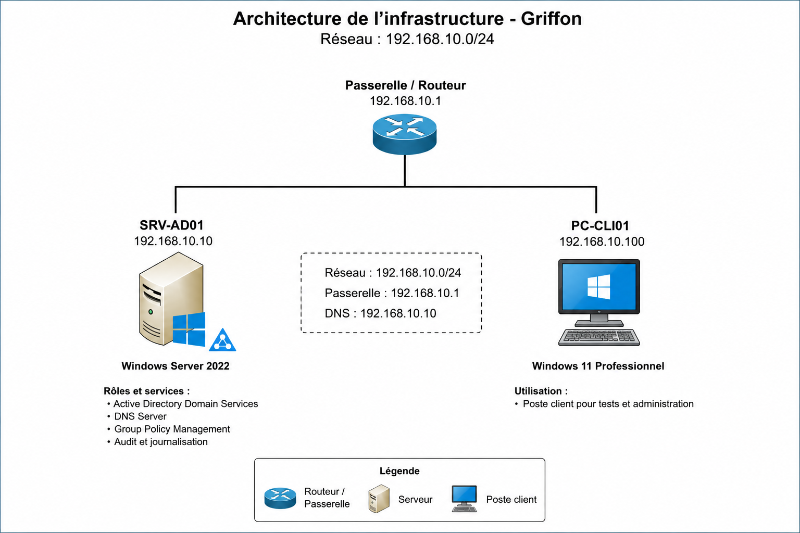

\# Projet 01 - Infrastructure AD sécurisée Griffon

\## Présentation

Ce projet a été réalisé dans le cadre de ma préparation au titre professionnel de Technicien Supérieur Systèmes et Réseaux (TSSR).

Il s'appuie sur les compétences acquises au cours de mon stage de fin de formation effectué dans le secteur de l'aérospatial et de la défense.

L'objectif est de reproduire dans un environnement de laboratoire personnel une infrastructure Active Directory sécurisée inspirée des problématiques rencontrées en environnement professionnel, tout en respectant strictement les obligations de confidentialité.

L'ensemble des configurations, données, noms d'hôtes, utilisateurs, adresses IP et éléments d'architecture présentés dans ce dépôt sont fictifs et ont été recréés spécifiquement pour ce projet.

Aucune donnée opérationnelle, information sensible ou configuration issue de l'environnement professionnel n'est reproduite.

\---

\## Objectifs pédagogiques

\* Déployer une infrastructure Active Directory sous Windows Server 2022

\* Mettre en œuvre les services DNS associés

\* Structurer l'annuaire Active Directory selon les bonnes pratiques Microsoft

\* Implémenter le modèle AGDLP pour la gestion des droits

\* Déployer des stratégies de groupe (GPO)

\* Mettre en œuvre des mesures de durcissement système

\* Réaliser des remédiations inspirées des benchmarks CIS

\* Appliquer des recommandations issues des guides ANSSI

\* Produire une documentation technique complète

\---

## Architecture

\## Architecture du laboratoire

\### Domaine

griffon.local

\### Contrôleur de domaine principal

SRV-AD01

\### Services déployés

\* Active Directory Domain Services

\* DNS

\* Group Policy Management

\* Journalisation et audit

\* Gestion centralisée des comptes et groupes

\---

\## Technologies utilisées

\* Windows Server 2022

\* Active Directory Domain Services

\* DNS

\* PowerShell

\* Group Policy Management

\* CIS Benchmark

\* Recommandations ANSSI

\---

\## Compétences démontrées

\* Administration Active Directory

\* Gestion des identités et des accès

\* Mise en œuvre du modèle AGDLP

\* Administration DNS

\* Déploiement et gestion de GPO

\* Durcissement d'un environnement Windows

\* Automatisation PowerShell

\* Documentation d'exploitation

\---

\## Structure du dépôt

\* Documentation : procédures et documentation technique

\* Scripts : scripts PowerShell utilisés

\* GPO : configuration et documentation des stratégies de groupe

\* Schemas : schémas d'architecture

\* Captures : captures d'écran du laboratoire

\---

\## Statut

Projet en cours de réalisation dans le cadre du portfolio technique TSSR.

